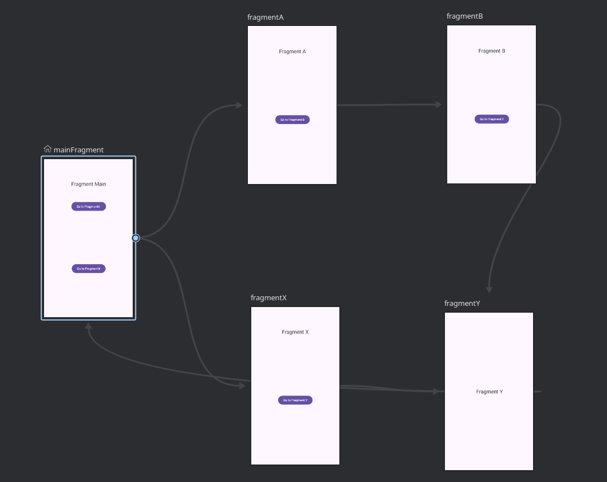

# Android Navigation Component Example: Custom Back Button Behavior

This project is a simple example demonstrating how to implement a specific navigation flow using the Android Navigation Component. It was developed using Kotlin and XML (including the Navigation Graph).

The project specifically aims to show how to return directly to the start fragment (`MainFragment`) when the back button is pressed from a specific fragment (`FragmentY`), skipping the intermediate steps in the back stack.

## Navigation Flow

The navigation flow within the application is as follows:

1.  **`MainFragment` (Home Screen):** The starting point of the application.
    * Clicking the "GO > A" button navigates to `FragmentA`.
    * Clicking the "GO > X" button navigates to `FragmentX`.

2.  **`FragmentA` (Page A):**
    * Clicking the "GO > B" button navigates to `FragmentB`.

3.  **`FragmentB` (Page B):**
    * Clicking the "GO > Y" button navigates to `FragmentY`.

4.  **`FragmentX` (Page X):**
    * Clicking the "GO > Y" button navigates to `FragmentY`.

5.  **`FragmentY` (Page Y):**
    * **Important Behavior:** When on this fragment, pressing the device's back button navigates the user directly back to `MainFragment`. The intermediate steps in the navigation history (`FragmentB` or `FragmentX`) are skipped. This is achieved using attributes like `app:popUpTo="@id/mainFragment"` and `app:popUpToInclusive="false"` (or `true`, depending on the case) in the actions leading to `FragmentY` within the Navigation Graph (`nav_graph.xml`).

## Navigation Graph

The structure of the Navigation Graph, which manages transitions between fragments in the application, is as follows:

## Technology Stack

* **Kotlin:** The main programming language.
* **XML:** Used for layout designs and the Navigation Graph.
* **Android Navigation Component:** Used to manage transitions between fragments and navigation logic.
